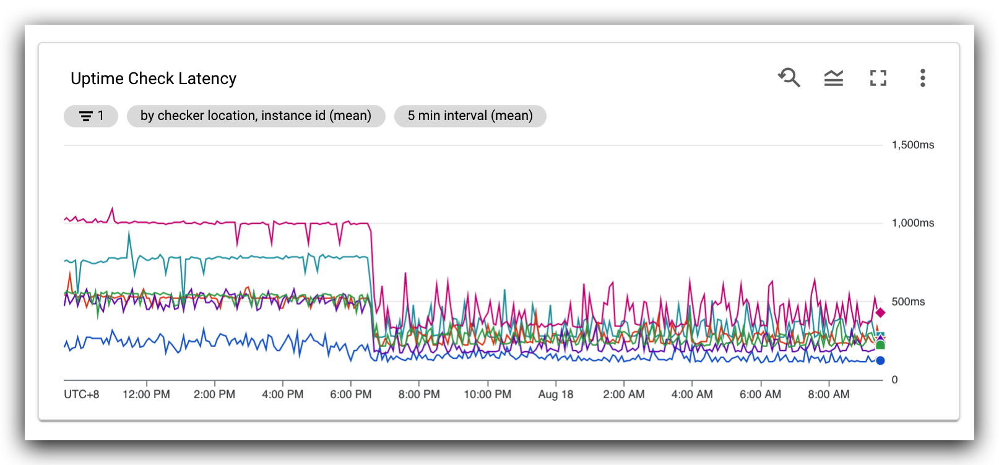
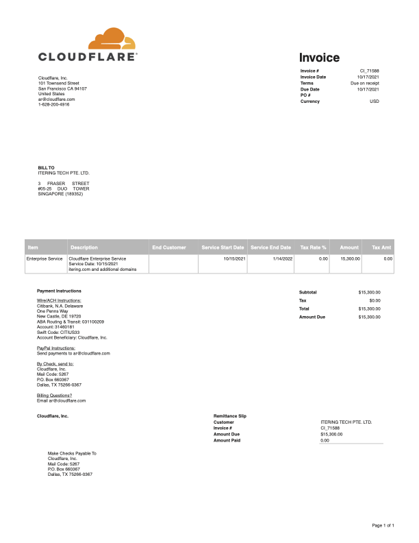
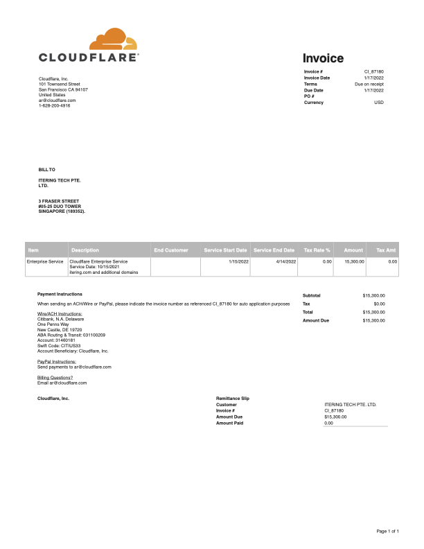

# Cloudflare Enterprise Plan for Subscan from January 2022 to April 2022

## About Subscan

Subscan is an aggregate high-precision blockchain explorer for Substrate-based chains. We have been supporting several influential blockchains, including Polkadot, Kusama, Rococo, and Westend for over a year. For many users, Subscan is their first stop in the blockchain world. As we continue to deliver new features and support more blockchains, our user base is on the steady rise. Therefore, high robustness and availability are currently among our major concerns.

## About the previous proposal

In the [previous proposal](https://polkadot.polkassembly.io/treasury/60), we explained **Why We Can't Do Without a Firewall?**
and **Why We Need the Cloudflare Enterprise Plan?**

We greatly appreciate the support from Polkadot Treasury and all the community members, Subscan has integrated with Cloudflare Enterprise since August 16th, the enterprise plan really helps us reduce the service latencies significantly. It has been working smoothly for the past 6 months, with no noticeable Cloudflare incidents up to now.

The previous proposal was for advance payment, now I am here to update the whereabouts of the money. Although Subscan has integrated with Cloudflare Enterprise since August 16th, due to trial and commissioning, the first two months are free and the formal payments began on October 15. The invoice is as follows:

## The Financial Support

This time we apply for the fee from January 15, 2022 to April 14, 2022, and the invoice is as follows:

This proposal is for Subscan's Cloudflare enterprise plan (mid-January to mid-April), the Cloudflare enterprise service fee is **$15,300**. 

As subscan grows, we will strive to cover more and more costs until fully independent . This plan applies for 85% of the cost of Cloudflare enterprise service: **15,300 * 85% = $13,005**

Therefore, the amount we are requesting is **613 DOT (1 DOT ≈ 21.20 $USD)**.

In case we missed any information or you have any questions, please feel free to send us an inquiry.

## References

- Cloudflare Enterprise plan: <https://www.cloudflare.com/plans/enterprise/>
- Cloudflare Argo: <https://www.cloudflare.com/products/argo-smart-routing/>

The source code of this proposal is hosted on [GitHub](https://github.com/itering/subscan-treasury-proposals/tree/master/cloudflare-enterprise-2022-Jan-to-Apr).
